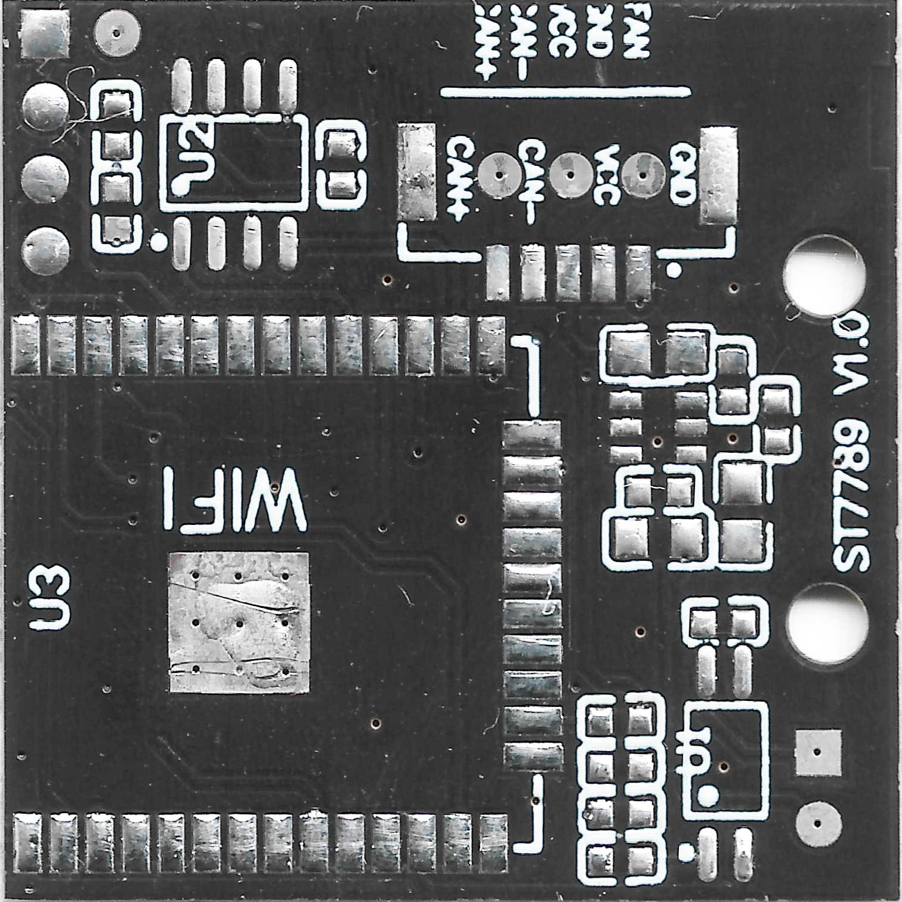
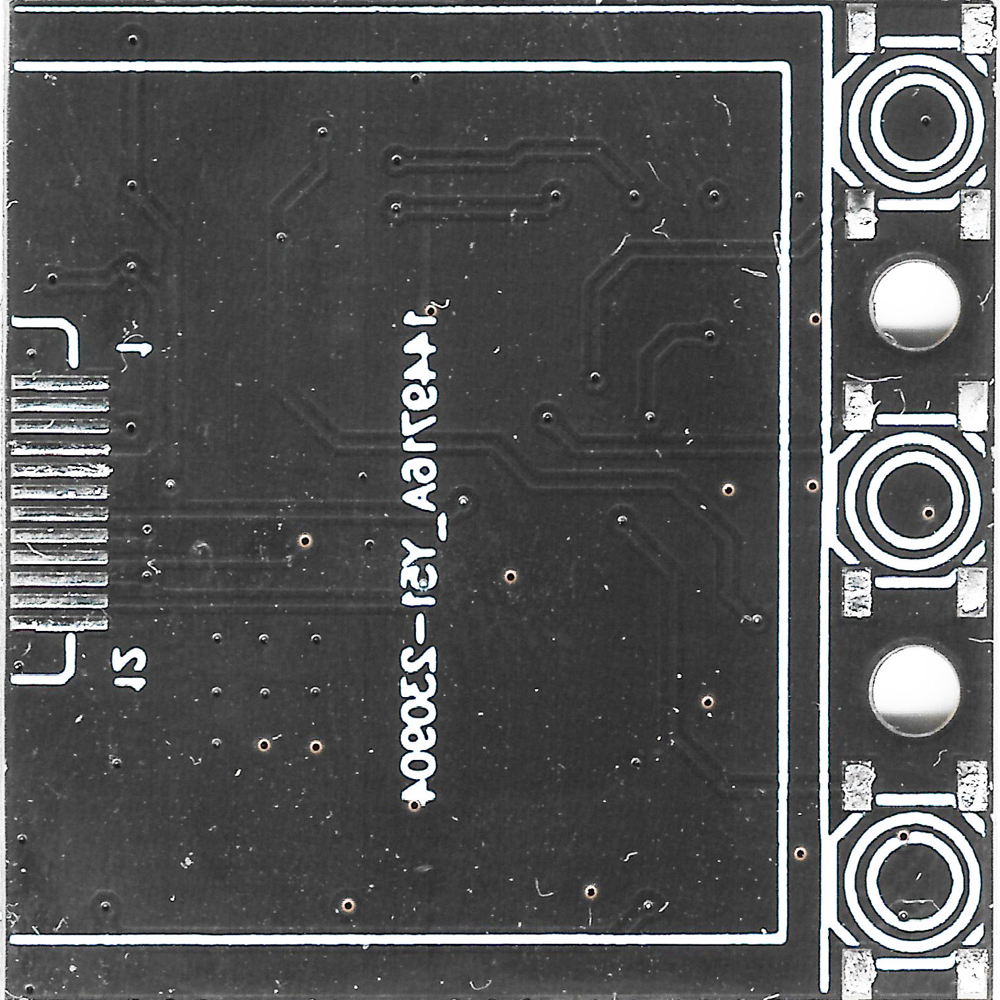
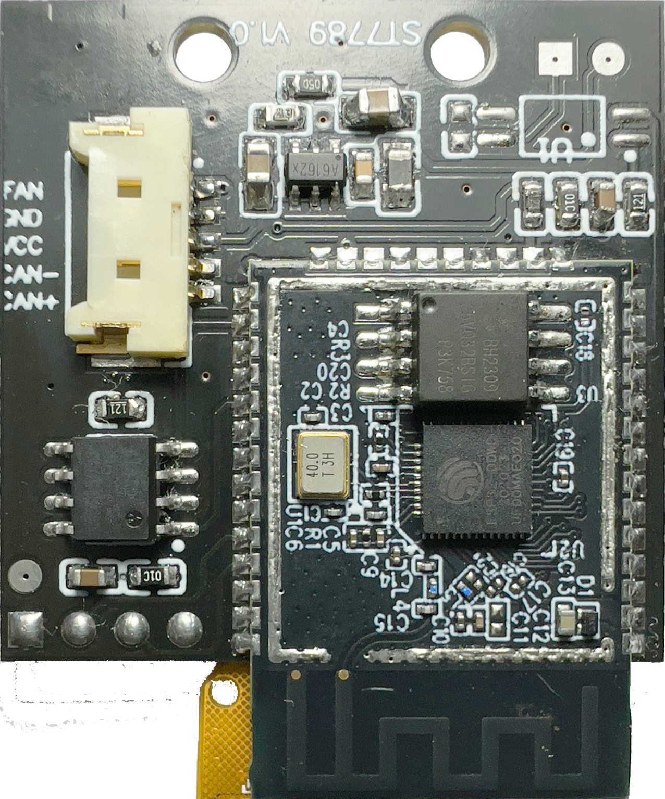
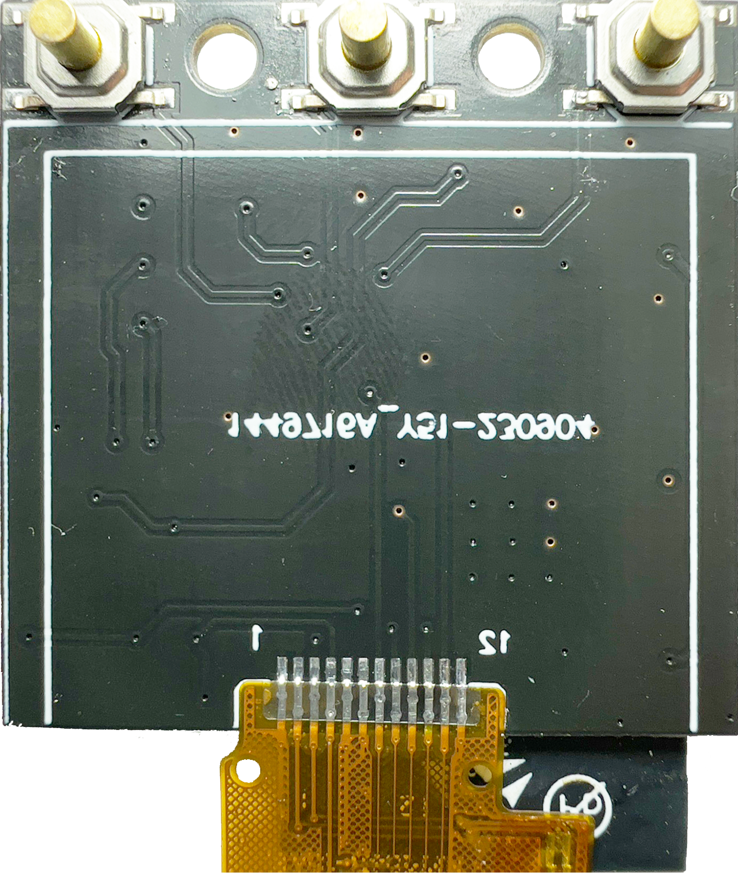
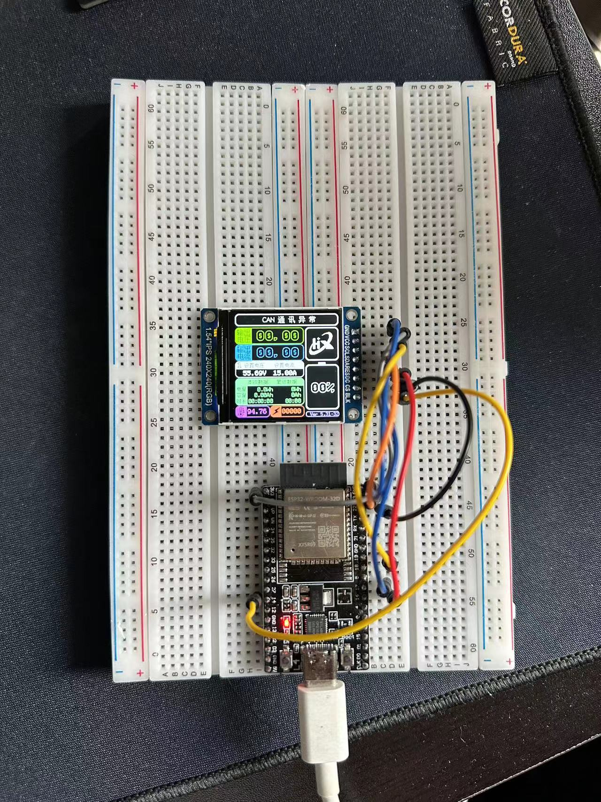

# CANControl reverse

## Image

### PCB Image

| TOP                   | BOTTOM                   |
| --------------------- | ------------------------ |
|    |    |
|  |  |

### Test

## Support protocol

### Huawei R48xx protocol

| Device        | Support |
| ------------- | ------- |
| Huawei R48100 | ✅      |
| Huawei R4875  | ✅      |
| Huawei R4850  | ✅      |
| Huawei R4830  | ✅      |
| Huawei R4815  | ✅      |

### ZTE 3000 protocol

| Device            | Support       |
| ----------------- | ------------- |
| ZTE ZXD 3000 V5.5 | ✅            |
| ZTE ZXD 3000 V5.6 | ✅            |
| ZTE ZXD 3000 V5.7 | ✅            |
| ZTE ZXD 3000 V5.8 | ✅            |
| ZTE ZXD 4000      | ⚠️ (Unstable) |

### ZTE 4875 protocol

| Device            | Support      |
| ----------------- | ------------ |
| ZTE ZXEPS R4875F1 | ✅           |
| ZTE ZXEPS R4850F1 | ⚠️ (No test) |
| ZTE ZXD 3000 V6.6 | ⚠️ (No test) |

### EPS6020 protocol

| Device  | Support |
| ------- | ------- |
| EPS4820 | ✅      |
| EPS6020 | ✅      |
| EPS7220 | ✅      |

### Increase protocol

| Device                 | Support |
| ---------------------- | ------- |
| Increase TR72-3500     | ✅      |
| Increase TR48-3000     | ✅      |
| Increase TR240-6000    | ✅      |
| Increase EVR500-10000  | ✅      |
| Increase EVR700-15000C | ✅      |
| Increase other models  | ✅      |

### INFY protocol

| Device            | Support      |
| ----------------- | ------------ |
| INFY REG50010S    | ✅           |
| INFY other models | ⚠️ (No test) |

## GPIO

### LCD Screen ST7789

| ESP32 | LCD  |
| ----- | ---- |
| IO23  | SDIN |
| IO22  | CS   |
| IO19  | CLK  |
| IO17  | RES  |
| IO16  | D/C  |
| IO14  | BLK  |

### CAN

| ESP32 | CAN |
| ----- | --- |
| IO5   | TX  |
| IO4   | RX  |

### KEY

Low level trigger

| ESP32 | KEY                       |
| ----- | ------------------------- |
| IO2   | UP KEY                    |
| IO0   | CENTER KEY & DOWNLOAD KEY |
| IO15  | DOWN_KEY                  |

### FAN PWM

| ESP32 | Position |
| ----- | -------- |
| IO27  | PCB      |
| IO13  | FAN PCB  |
